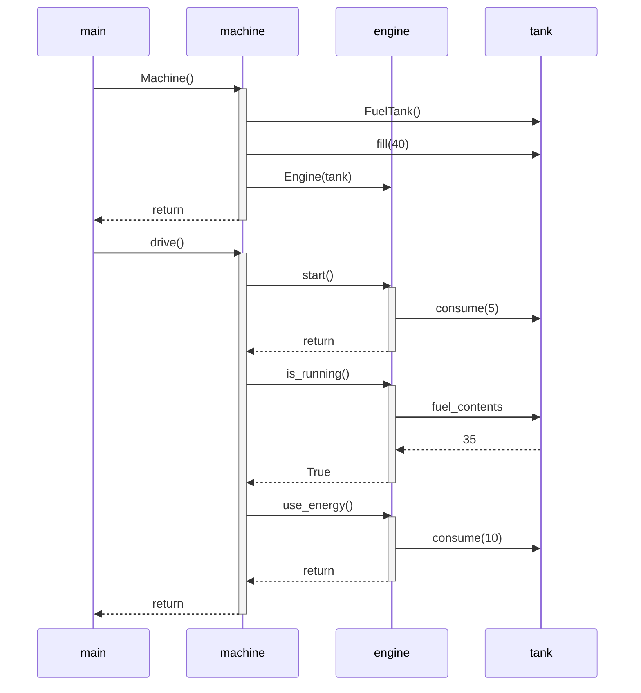

```mermaid
 sequenceDiagram
	participant mn as main
	participant mc as machine
	participant e as engine
	participant f as tank

	mn->>mc: Machine()
	activate mc
	mc->>f: FuelTank()
	mc->>f: fill(40)
	mc->>e: Engine(tank)
	mc-->>mn: return
	deactivate mc
	mn->>mc: drive()
	activate mc
	mc->>e: start()
	activate e
	e->>f: consume(5)
	e-->>mc: return
	deactivate e
	mc->>e: is_running()
	activate e
	e->>f: fuel_contents
	f-->>e: 35
	e-->>mc: True
	deactivate e
	mc->>e: use_energy()
	activate e
	e->>f: consume(10)
	e-->>mc: return
	deactivate e
	mc-->>mn: return
	deactivate mc	
```
