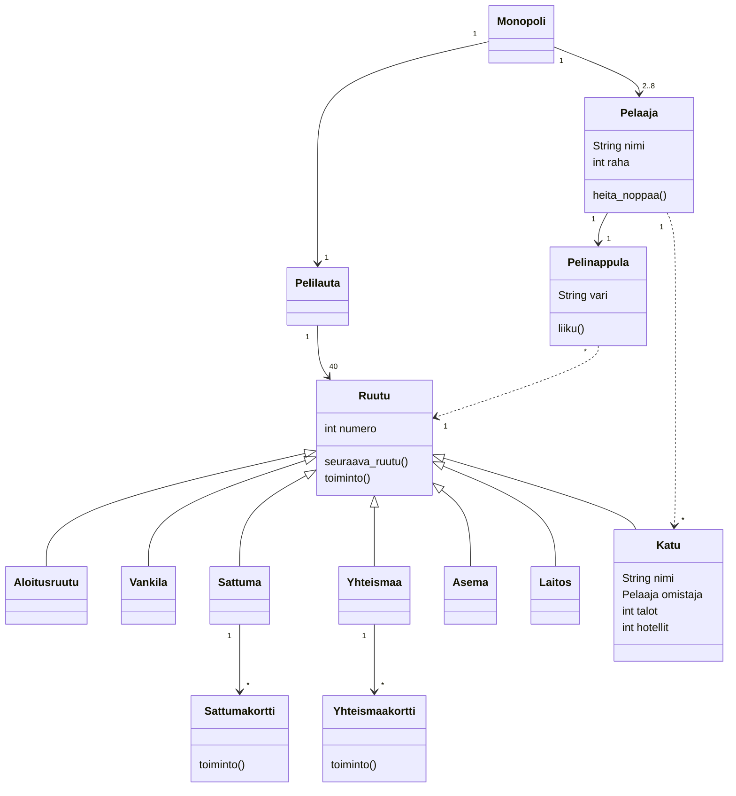

```mermaid
 classDiagram
	Monopoli "1" --> "2..8" Pelaaja
	Pelaaja "1" --> "1" Pelinappula
	Monopoli "1" --> "1" Pelilauta
	Pelilauta "1" --> "40" Ruutu
	Pelinappula "*" ..> "1" Ruutu
	Ruutu <|-- Aloitusruutu
	Ruutu <|-- Vankila
	Ruutu <|-- Sattuma
	Ruutu <|-- Yhteismaa
	Ruutu <|-- Asema
	Ruutu <|-- Laitos
	Ruutu <|-- Katu
	Sattuma "1" --> "*" Sattumakortti
	Yhteismaa "1"  --> "*" Yhteismaakortti
	Pelaaja "1" ..> "*" Katu

	class Pelaaja{
		String nimi
		int raha
		heita_noppaa()
	}
	class Ruutu{
		int numero
		seuraava_ruutu()
		toiminto()
	}
	class Pelinappula{
		String vari
		liiku()
	}
	class Sattumakortti{
		toiminto()
	}
	class Yhteismaakortti{
		toiminto()
	}
	class Katu{
		String nimi
		Pelaaja omistaja
		int talot
		int hotellit
	}	
```
