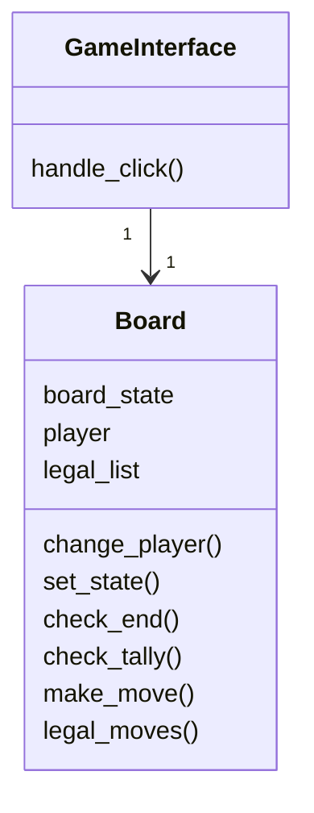

GameInterface ottaa ui:lta vastaan klikkausten koordinaatteja ja antaa ne laudalle käsiteltäväksi.

```mermaid
 classDiagram
	GameInterface "1" --> "1" Board
	class GameInterface{
		handle_click()
	}
	class Board{
		board_state
		player
		legal_list
		change_player()
		set_state()
		check_end()
		check_tally()
		make_move()
		legal_moves()
	}
```
