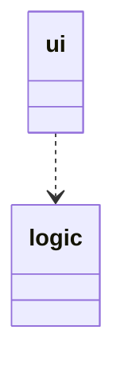
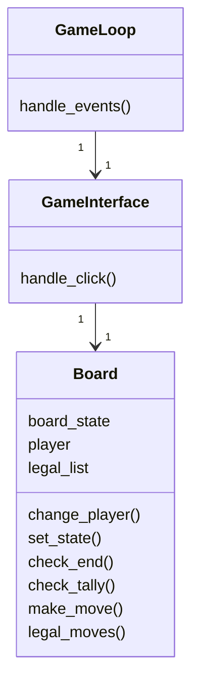
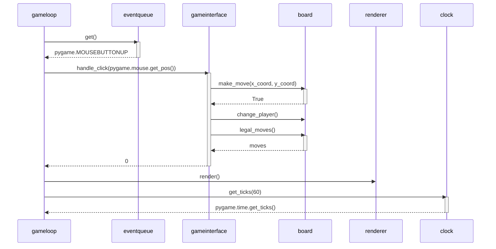

# Arkkitehtuurikuvaus

## Rakenne

Sovelluksen rakenne on kaksitasoinen kerrosarkkitehtuuri.

Käyttöliittymästä vastavaa koodi on pakkauksessa ui ja sovelluslogiikasta vastaava pakkauksessa logic.

## Käyttöliittymä

Sovellukselle on tehty graafinen käyttöliittymä.

Sovellusta ohjataan hiirtä klikkaamalla, jolloin _gameinterface_ muuttaa pelin tilaa ja _renderer_ päivittää pelin ruudun.

## Sovelluslogiikka

_GameInterface_ ottaa _GameLoopilta_ vastaan klikkausten koordinaatteja ja antaa ne laudalle käsiteltäväksi.

Yhden siirron pelaaminen sekvenssikaaviona

